# Generative Art · Python

Generative art scripts built with **NumPy** and **Matplotlib** — no extra dependencies.
Each script runs standalone and saves a PNG to the `img/` folder.

---

## Gallery

<table>
<tr>
<td align="center">
  <a href="artworks/01_organic_stems.py">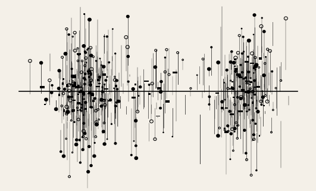<br/>
  <b>01 · Organic Stems</b></a>
</td>
<td align="center">
  <a href="artworks/02_low_poly_mesh.py">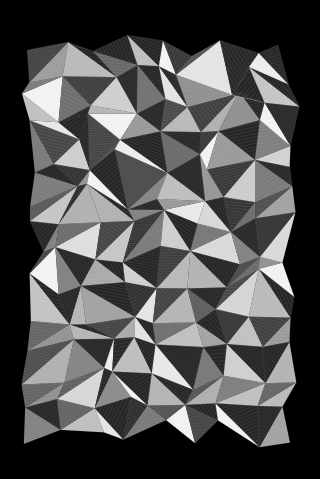<br/>
  <b>02 · Low Poly Mesh</b></a>
</td>
<td align="center">
  <a href="artworks/03_curved_hatch.py">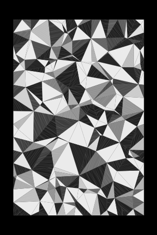<br/>
  <b>03 · Curved Hatch</b></a>
</td>
</tr>
<tr>
<td align="center">
  <a href="artworks/04_flower_of_life.py">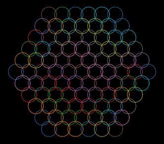<br/>
  <b>04 · Flower of Life</b></a>
</td>
<td align="center">
  <a href="artworks/05_metatron_cube.py">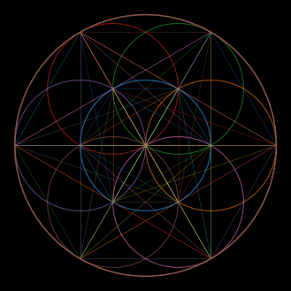<br/>
  <b>05 · Metatron's Cube</b></a>
</td>
<td align="center">
  <a href="artworks/06_cipher_mandala.py">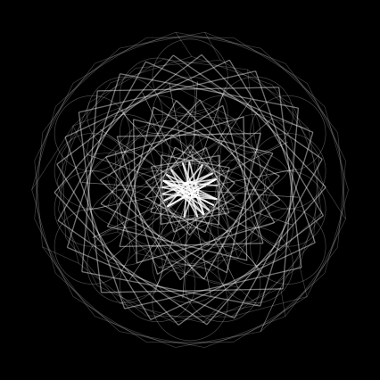<br/>
  <b>06 · Cipher Mandala</b></a>
</td>
</tr>
<tr>
<td align="center">
  <a href="artworks/07_cathedral_lace.py">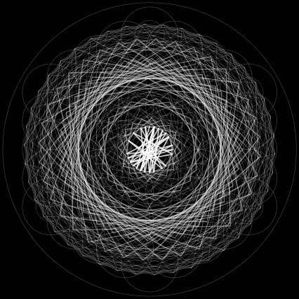<br/>
  <b>07 · Cathedral Lace</b></a>
</td>
<td align="center">
  <a href="artworks/08_square_temple.py">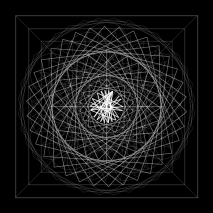<br/>
  <b>08 · Square Temple</b></a>
</td>
<td align="center">
  <a href="artworks/09_yantra_engine.py">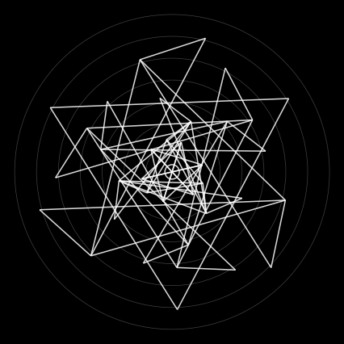<br/>
  <b>09 · Yantra Engine</b></a>
</td>
</tr>
<tr>
<td align="center">
  <a href="artworks/10_torus_knot_mandala.py">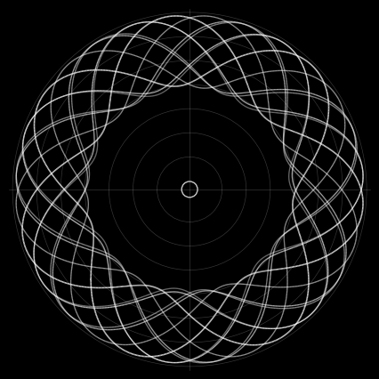<br/>
  <b>10 · Torus Knot Mandala</b></a>
</td>
<td align="center">
  <a href="artworks/11_phyllotaxis_temple.py">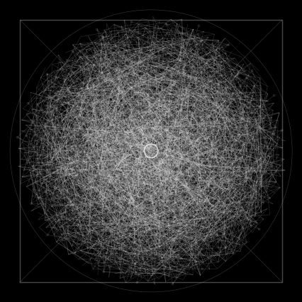<br/>
  <b>11 · Phyllotaxis Temple</b></a>
</td>
<td></td>
</tr>
</table>

---

## Usage

```bash
pip install -r requirements.txt

# run a single artwork
python artworks/04_flower_of_life.py

# run the parametric generator
python template/generator.py
```

Output PNGs are saved to `img/` (full resolution, git-ignored).

---

## Template / Generator

`template/generator.py` is a parametric version of the Phyllotaxis Temple.
Edit these three variables at the top:

```python
density = "low"     # "low" | "mid" | "high"
mood    = "ritual"  # "ritual" | "techno" | "minimal"
gates   = "none"    # "square" | "octagon" | "none"
```

Each combination produces a unique composition. Output is saved as
`img/generator_{density}_{mood}_{gates}.png`.

---

## Structure

```
.
├── artworks/              # 11 standalone scripts
├── template/              # parametric generator
├── img/
│   └── previews/          # low-res previews for this README
└── requirements.txt
```

---

## Dependencies

- Python 3.9+
- `numpy`
- `matplotlib`

---

## License

© 2025 Matteo Cavo — [CC BY-NC 4.0](https://creativecommons.org/licenses/by-nc/4.0/)
Free to share and adapt with attribution. Commercial use is not permitted.
